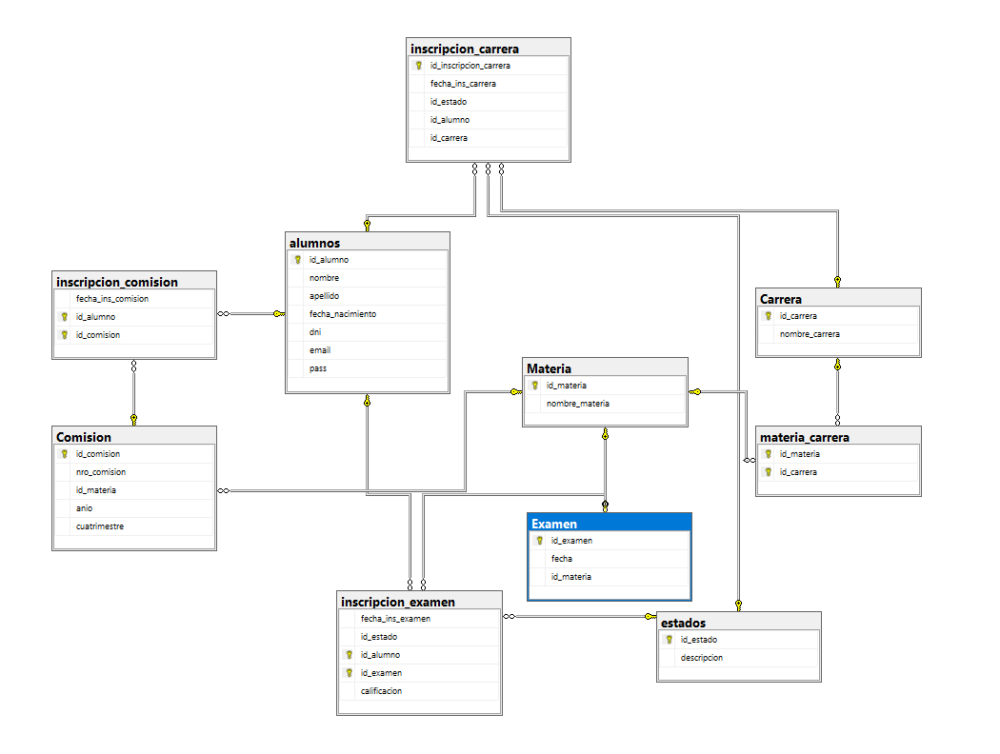

Universidad Nacional del Nordeste

Licenciatura en sistemas e información

Bases de Datos 1

Sistema de Gestión Académica
GestAcad

Profesor: Carlos Villegas

Grupo número 38:
- Bazzola Gabriel Esteban
- Rojas Yaccuzzi Joaquin
- Zambrano Franco
- Mazzanti Marcos Santino

# Índice

1. [Capítulo I: Introducción](#capítulo-i-introducción)  
   1.1. [Tema](#tema)  
   1.2. [Planteamiento del problema](#planteamiento-del-problema)  
   1.3. [Objetivo general](#objetivo-general)  
   1.4. [Objetivos específicos](#objetivos-específicos)  
   1.5. [Alcance](#alcance)  
2. [Capítulo II: Marco conceptual o referencial](#capítulo-ii-marco-conceptual-o-referencial)  
3. [Capítulo III: Metodología](#capítulo-iii-metodología)  
   3.1. [Descripción del proceso](#descripción-del-proceso)  
   3.2. [Herramientas utilizadas](#herramientas-utilizadas)  
4. [Capítulo IV: Desarrollo del tema / Resultados](#capítulo-iv-desarrollo-del-tema--resultados)  
   4.1. [Modelo entidad-relación](#modelo-entidad-relación)  
   4.2. [Diagrama de entidad-relación](#diagrama-de-entidad-relación)  
5. [Capítulo V: Conclusiones](#capítulo-v-conclusiones)  
6. [Capítulo VI: Bibliografía](#capítulo-vi-bibliografía)  

 

## CAPÍTULO I: INTRODUCCIÓN
### Tema
El proyecto aborda el diseño e implementación de una base de datos académica denominada gestAcad, orientada a centralizar la información vinculada a los alumnos de una institución educativa.
El foco está en organizar y digitalizar los procesos relacionados con inscripciones a carreras, materias, comisiones y exámenes, así como el registro de calificaciones y estados académicos.
________________________________________
### Planteamiento del problema
Actualmente, la gestión académica suele realizarse en sistemas poco integrados o incluso en registros físicos, lo que provoca:
•	Dificultades para mantener un historial confiable de inscripciones y calificaciones.
•	Errores o inconsistencias en la administración de materias, comisiones y exámenes.
•	Información dispersa y propensa a pérdidas.
•	Complejidad para obtener una visión clara del estado académico de los alumnos.
Por lo tanto, surge la necesidad de contar con una base de datos centralizada que garantice un registro organizado, consistente y seguro de toda la trayectoria académica del estudiante.
________________________________________
### Objetivos
Objetivo general
Desarrollar e implementar un modelo de base de datos (gestAcad) que permita gestionar de manera integral la información académica de los alumnos, abarcando inscripciones, exámenes, comisiones y estados académicos.
Objetivos específicos
•	Registrar alumnos con datos personales únicos y validados.
•	Administrar carreras y vincularlas con sus materias correspondientes.
•	Gestionar inscripciones a carreras, materias, comisiones y exámenes.
•	Registrar calificaciones y estados de los exámenes.
•	Mantener el seguimiento del estado académico de cada alumno (activo, regular, aprobado, desaprobado, etc.).
•	Garantizar la trazabilidad de la trayectoria académica completa del estudiante.
________________________________________
### Alcance
El proyecto se limita al modelado y puesta en marcha de una base de datos enfocada en los alumnos.
No incluye otros módulos administrativos ni de gestión institucional, centrándose únicamente en el núcleo académico: carreras, materias, comisiones, exámenes y estados asociados al alumno.
________________________________________
### CAPITULO II: MARCO CONCEPTUAL O REFERENCIAL
Marco conceptual
Este proyecto responde a la necesidad de organizar y centralizar la información académica de los alumnos, asegurando procesos más claros y eficientes en las instituciones educativas.
La base de datos busca:
•	Mejorar la administración de inscripciones.
•	Ofrecer un registro histórico y confiable de la trayectoria del alumno.
•	Facilitar el análisis académico mediante la información normalizada.
La implementación de un sistema de este tipo contribuye a la digitalización educativa, simplificando la gestión interna y brindando mayor precisión en la información.
________________________________________
## CAPÍTULO III: METODOLOGÍA SEGUIDA
Metodología
### Descripción del proceso
El desarrollo del proyecto se llevó a cabo siguiendo un enfoque ágil, tomando principios de Scrum como base organizativa para dividir el trabajo en etapas.
Las actividades principales fueron:
•	Definición del problema y objetivos.
•	Modelado de la base de datos con ERD Plus.
•	Normalización de las tablas.
•	Generación del código SQL para la implementación en SQL Server Management Studio.
•	Ajustes y validaciones del modelo en función de los requerimientos académicos.
### Herramientas utilizadas
•	ERD Plus: construcción del modelo entidad-relación.
•	SQL Server Management Studio: implementación y pruebas de la base de datos.
•	Herramientas ofimáticas (Word, Excel): documentación y organización del proyecto.
________________________________________
## CAPÍTULO IV: DESARROLLO DEL TEMA / PRESENTACIÓN DE RESULTADOS
### Modelo entidad-relación
A partir del modelado realizado, se diseñó la base de datos de gestAcad, estructurada en torno al alumno como entidad principal.
El esquema contempla las siguientes relaciones clave:
•	Inscripciones de alumnos a carreras, materias, comisiones y exámenes.
•	Administración de carreras y materias.
•	Registro de exámenes con calificaciones y estados académicos.
•	Asociación de estados a cada proceso académico (activo, regular, aprobado, desaprobado, etc.).
### Diagrama de entidad-relación

El modelo asegura la integridad referencial mediante claves primarias y foráneas, y ofrece una visión clara de
la trayectoria académica del estudiante desde su ingreso a una carrera hasta la aprobación de sus exámenes.
________________________________________
## CAPÍTULO V: CONCLUSIONES 
El proyecto gestAcad permitió diseñar e implementar una base de datos sólida y normalizada, capaz de centralizar toda la información académica de los alumnos.
Con este enfoque, se resolvieron problemas asociados a la dispersión y falta de confiabilidad de los registros, logrando un sistema estructurado que refleja de manera precisa la trayectoria académica de cada estudiante.

________________________________________
## VI: Bibliografía

- Unidad 2: Diseño de Bases de Datos y el Modelo Entidad-Relación. Aula Virtual – Base de Datos I.  
- Unidad 3: El modelo relacional. Aula Virtual – Base de Datos I.  
- Unidad 5: SQL y SQL Avanzado. Aula Virtual – Base de Datos I.  
- El Lenguaje de Definición de Datos (DDL) y su aplicación en Bases de Datos Relacionales. Aula Virtual – Base de Datos I.  
- ERDPlus. Herramienta para el modelado de bases de datos. Disponible en: [https://erdplus.com](https://erdplus.com)  
