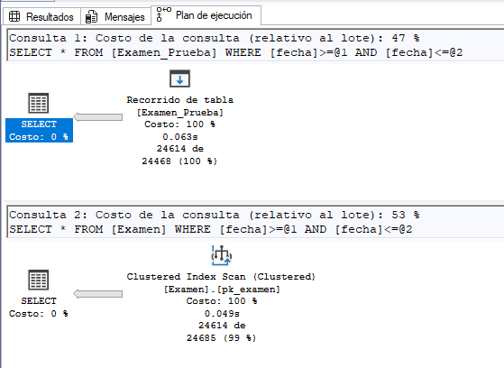
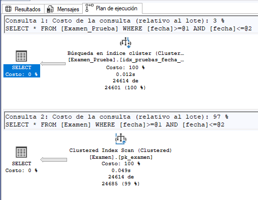
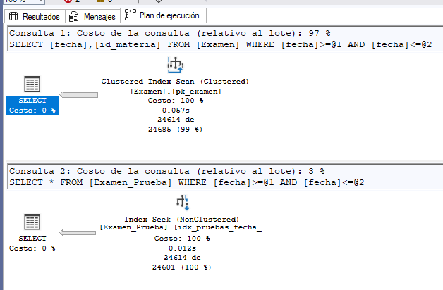
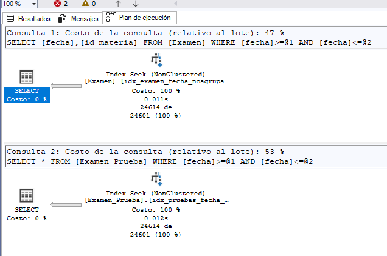

Optimización de consultas a través de índices

# Índice

1.[Capítulo I: Introducción](#introducción)

2.[Capítulo II: Tipos de índices](#tipos-de-índices)

2.1. [Índice agrupado (Clustered)](#índice-agrupado-clustered)

2.2. [Índice no agrupado (Non-Clustered)](#índice-no-agrupado-non-clustered)

2.3. [Otros tipos de índices](#otros-tipos-de-índices)

3. [Capítulo III: Resultados de las pruebas](#resultados-de-las-pruebas)

3.1. [Comparación sin índice agrupado](#comparación-sin-índice-agrupado)

3.2. [Comparación con índice agrupado](#comparación-con-índice-agrupado)

3.3. [Comparación con índice no agrupado](#comparación-con-índice-no-agrupado)

3.4. [Comparación con índice no agrupado en ambas tablas](#comparación-con-índice-no-agrupado-en-ambas-tablas)

4. [Capítulo IV: Evaluación de resultados](#evaluación-de-resultados)

5. [Capítulo V: Conclusiones](#conclusión)

6. [Capítulo VI: Bibliografía](#bibliografía)

## Introducción

En este trabajo se analiza el impacto que tienen los índices en el rendimiento de las consultas dentro de una base de datos. Para ello se realizaron distintas pruebas sobre una tabla que contiene un campo de tipo fecha, evaluando los tiempos de respuesta y los planes de ejecución antes y después de aplicar diferentes tipos de índices. El objetivo fue comprobar cómo el uso adecuado de estas estructuras permite optimizar la búsqueda de información, reduciendo el número de páginas leídas y mejorando la eficiencia del motor de base de datos.

## Tipos de índices
### Índice agrupado (Clustered)

Un índice agrupado define el orden físico en el que se almacenan las filas de una tabla según una o más columnas. Solo puede existir uno por tabla, ya que únicamente se puede ordenar físicamente de una manera.
Al crear un índice agrupado sobre una columna, los datos se reordenan físicamente siguiendo los valores de dicha columna. Esto permite que, cuando se ejecuta una consulta por rangos (por ejemplo, entre fechas), el motor acceda directamente al punto inicial y lea secuencialmente las filas correspondientes, evitando un recorrido completo de la tabla.

Ventajas:

Mejora considerablemente el rendimiento de consultas que filtran por rangos.

Reduce la cantidad de lecturas necesarias (menos I/O).

Aprovecha el orden físico de la tabla.

Desventajas:

Solo puede haber uno por tabla.

Insertar o actualizar datos puede requerir reorganizar físicamente las páginas.

No es recomendable en columnas con valores repetidos o que cambian con frecuencia.

Coodigo SQL para crear indice el indice

CREATE CLUSTERED INDEX idx_pruebas_fecha_agrupado
ON Examen_Prueba(fecha);

Con este índice, la tabla Examen_Prueba se organiza físicamente según la columna fecha, optimizando las búsquedas que filtran por periodos de tiempo.

### Índice no agrupado (Non-Clustered)

A diferencia del agrupado, el índice no agrupado no altera el orden físico de la tabla. Es una estructura independiente que contiene los valores de las columnas del índice junto con punteros a las filas reales de la tabla.
Una tabla puede tener varios índices no agrupados, lo que permite optimizar consultas específicas que utilicen distintas columnas en sus condiciones.

Ventajas:

Permite crear varios índices por tabla.

Mejora el rendimiento de consultas que no pueden beneficiarse del índice agrupado.

Es posible usar la cláusula INCLUDE para agregar columnas adicionales y cubrir completamente la consulta, evitando acceder a la tabla base.

Desventajas:

Requiere espacio adicional.

Puede necesitar un paso adicional de búsqueda (lookup) para acceder a los datos reales.

Su mantenimiento implica más consumo de CPU e I/O al modificar la tabla.

Codigo SQL utilizado para crear el indice
CREATE NONCLUSTERED INDEX idx_pruebas_fecha_noagrupado
ON Examen_Prueba(fecha)
INCLUDE (id_materia);

En este caso, el índice no agrupado utiliza fecha como clave principal e incluye id_materia para cubrir las consultas que requieren ambas columnas, reduciendo el acceso directo a la tabla base.

### Otros tipos de índices;

Índices únicos: garantizan que no existan valores duplicados en la columna o combinación de columnas especificadas. Son útiles cuando una columna debe tener valores distintos, como por ejemplo un número de documento o un correo electrónico.

Índices compuestos: combinan dos o más columnas como clave, mejorando el rendimiento en consultas que filtran o ordenan por más de un campo al mismo tiempo.

Índices filtrados: se crean sobre un subconjunto de filas que cumplen una condición específica. Son ideales cuando solo se necesita indexar una parte de la tabla (por ejemplo, registros activos o no nulos).

Índices en columnas calculadas: permiten indexar el resultado de una expresión o función, haciendo más rápidas las consultas que dependen de cálculos derivados.

Índices columnstore: almacenan los datos por columnas en lugar de filas, lo que los hace especialmente eficientes para consultas analíticas o de lectura intensiva en grandes volúmenes de datos (OLAP).

Índices hash: se utilizan en tablas optimizadas para memoria, permitiendo búsquedas extremadamente rápidas en valores exactos.

Índices no agrupados optimizados para memoria: también se aplican a tablas en memoria, pero almacenan referencias a las filas en estructuras tipo árbol, siendo útiles para búsquedas por rangos.

Índices espaciales: diseñados para trabajar con datos geográficos o espaciales, como coordenadas, polígonos o rutas.

Índices XML: permiten optimizar las consultas sobre columnas que almacenan datos en formato XML, mejorando la navegación dentro del contenido estructurado.

Índices de texto completo: se utilizan para realizar búsquedas eficientes dentro de textos largos, como descripciones o documentos, permitiendo localizar palabras o frases específicas dentro del contenido textual.

## Resultados de las pruebas

Para comprobar el efecto de los índices en el rendimiento, se realizaron cuatro escenarios: sin índice, con índice agrupado, con índice no agrupado y con índice no agrupado aplicado a ambas tablas. En cada caso se midieron los tiempos de respuesta y se analizaron los planes de ejecución del motor.

### Comparación sin índice agrupado

Figura 1. Comparación del rendimiento entre dos consultas sin índice agrupado.
En esta prueba, el motor realizó un Table Scan, recorriendo la tabla completa para encontrar las filas que cumplen la condición. El tiempo de respuesta fue significativamente mayor y el número de lecturas lógicas elevado.

### Comparación con índice agrupado

Figura 2. Comparación del rendimiento tras aplicar un índice agrupado.
La consulta se benefició del orden físico de la tabla, permitiendo un acceso secuencial eficiente mediante Index Seek. Se observó una notable disminución del tiempo de ejecución y del número de páginas leídas.

### Comparación con índice no agrupado

Figura 3. Comparación del rendimiento tras aplicar un índice no agrupado.
El índice no agrupado mejoró la búsqueda sobre la columna fecha, reduciendo el tiempo respecto al heap inicial. Al incluir id_materia, la consulta pudo resolverse directamente desde el índice, evitando la necesidad de lecturas adicionales en la tabla base.

### Comparación con índice no agrupado en ambas tablas

Figura 4. Comparación del rendimiento con índices no agrupados aplicados a las dos tablas involucradas.
Este escenario presentó el mejor resultado general, optimizando tanto la búsqueda principal como las uniones entre tablas. El plan de ejecución reflejó un acceso más eficiente y una reducción significativa en el costo total de la consulta.

## Evaluación de resultados

Las pruebas demostraron que la presencia de índices reduce drásticamente los tiempos de respuesta y la carga de lectura en disco. El índice agrupado resultó más beneficioso en consultas por rango de fechas, mientras que el no agrupado con columnas incluidas permitió optimizar consultas más específicas.
En todos los casos, el cambio del plan de ejecución de Table Scan a Index Seek fue un indicador claro de la optimización lograda.

## Conclusión

El uso de índices en SQL resulta fundamental para mejorar el rendimiento de las consultas, especialmente en bases de datos con gran volumen de información. A través de las pruebas realizadas, se pudo comprobar cómo la creación de índices optimiza los tiempos de búsqueda y filtrado, mientras que su eliminación o mal uso puede generar un impacto negativo. Entender cuándo y dónde aplicar cada tipo de índice es esencial para mantener un equilibrio entre velocidad y eficiencia en las operaciones del sistema.

## Bibliografía

https://learn.microsoft.com/es-es/sql/relational-databases/sql-server-index-design-guide 
https://learn.microsoft.com/es-es/sql/relational-databases/indexes/indexes?view=sql-server-ver16
Páginas visitada el 9/11/2025.